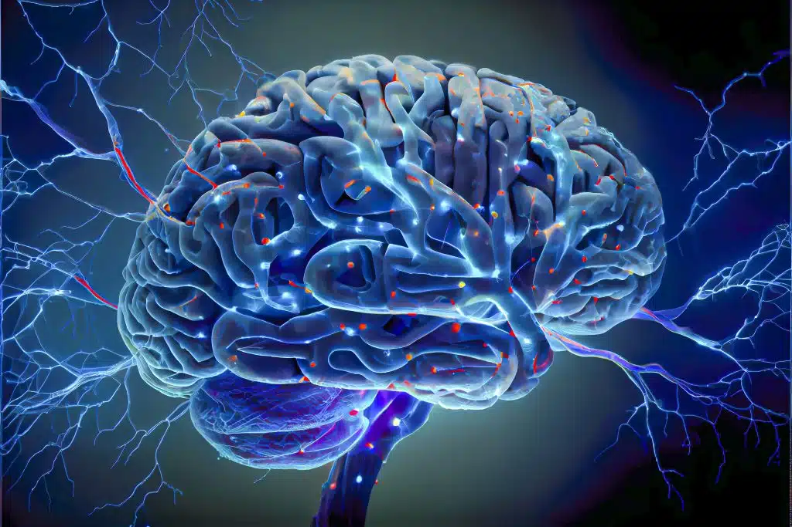

# Agile Challengers : Creation Presurgical Epilepsy Evaluation Platform

This project aims to develop a cutting-edge web application designed to revolutionize the way surgeons prepare for and execute neurosurgical procedures. By leveraging advanced 3D modeling technology, the platform will allow medical professionals to interact with and visualize patients' brain models in three dimensions, offering unprecedented insight and precision in pre-surgical planning. Additionally, the project encompasses the creation of comprehensive, step-by-step deployment documentation to ensure seamless setup, configuration, and utilization of the platform by healthcare institutions and professionals.

  

<h1>Table of Content</h1>

- [Objective](#objective)
- [Technology Stack](#technology-stack)
- [References](#references)
- [Contributors](#contributors)

## Objective
---
Develop a presurgical epilepsy evaluation platform that uses deep learning algorithms with EEG source imaging to accurately localize epileptogenic regions and provide a user friendly 3D visualization for better surgical planning and patient outcomes.

## Technology Stack
---

- React - Fronted Framework
- MNE Python - Backend Framework
- MongoDB - Database
- Amazon Web Service (AWS) - Cloud Storage
- Postman - API Testing
- Selenium, Junit - Software Testing
## References
1. [EEG Source Imaging: A Practical Review of the Analysis Steps](https://www.frontiersin.org/articles/10.3389/fneur.2019.00325/full)
2. [ConvDip: A Convolutional Neural Network for Better EEG Source Imaging](https://www.frontiersin.org/articles/10.3389/fnins.2021.569918/full)
3. [MNE-Python Tutorials](https://mne.tools/stable/auto_tutorials/index.html)
4. [BrainBrowser: web-based 3D visualization tool primarily used for viewing neurological data](https://brainbrowser.cbrain.mcgill.ca/)
5. (https://mcin.ca/technology/visualization/brainbrowser/)

## Contributors
---
[Bhumiti Gohel](https://github.com/bhumiti28) | [Dimpal Lad](https://github.com/Dimpal-lad) | [Krinal Akbari](https://github.com/Krinal-Akbari) | [Rinjal Patel](https://github.com/RinjalPatel490) | [Yash Soni](https://github.com/Yash55133)
